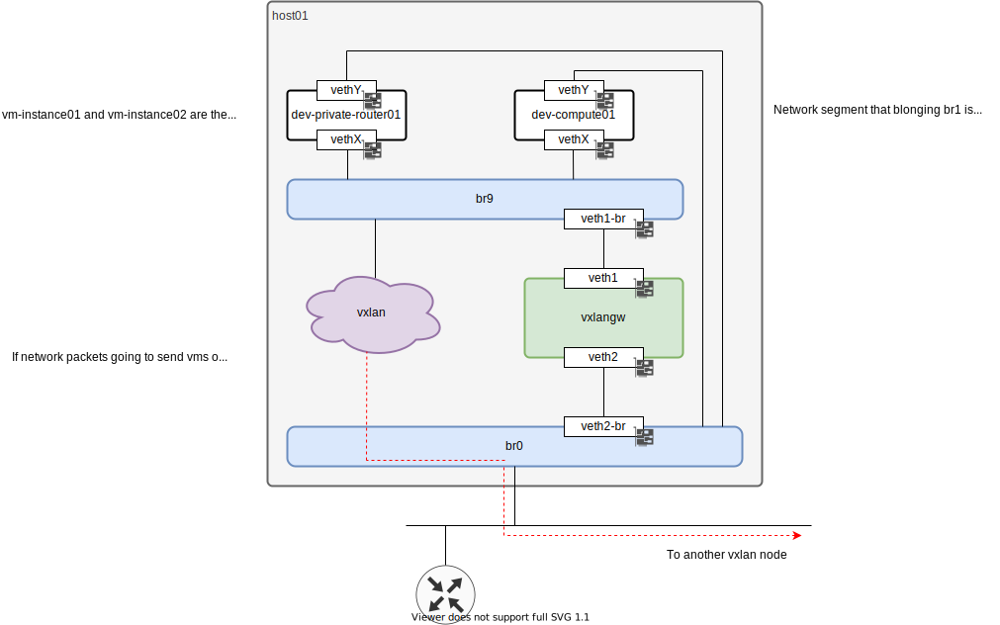

# Build development server

# Usage

```
$ . ./venv/bin/activate
(vnev) $ pip install -r requirements.txt
```

Install `ansible-galaxy` requirements.

```
(venv) $ ansible-galaxy install -r requirements.yml
```


`ansible-playbook` can run with checking mode by adding `--check` option like below.

```
(venv) $ ansible-playbook -i production -l [hostname or group name] --check sites.yml
// Some options might be needed like `--ask-pass`, `--become` or `--ask-become-pass` depending on your environment.
```

If NO errors were reported then you can run Ansible without the option `--check`.

```
(venv) $ ansible-playbook -l localhost site.yml
```

## Usage with docker
You can run the ansible if you can not prepare the environment to run ansible on your machine.
You have to copy SSH private key (in this example, that named `private-key`) that is used to login the host into the `build-dev-server-ansible` directory.

```
$ git clone https://github.com/tsuna-server/build-dev-server-ansible.git
$ cd build-dev-server-ansible
$ cp /path/to/private-key ./private-key
$ docker run --rm \
    --volume ${PWD}:/opt/ansible \
    --volume /path/to/private-key:/private-key \   # Specify your private key to connect to target-host
    --env ANSIBLE_HOST_KEY_CHECKING=False \        # If you want to skip host key checking
    --add-host target-host:x.x.x.x \               # Specify the host name and ip which you want to build the environment to
    tsutomu/tsuna-ansible-runner

* `--volume /path/to/private-key:/private-key` is the option to specify the private key that can log in to the node that you want to build the environment to.
* `--add-host target-host:x.x.x.x` is the option to specify the host name and ip which you want to build the environment to.
```

## Add a route after ansible was finished
You should add a route to connect to the instances on management segment like below.

```
# # format)
# ip route add <management IP segment> via <gateway to management IP segment>
# # e.g.)
# ip route add 192.168.2.0/24 via 192.168.1.254
```
You can find the IP `<gateway to management IP segment>` as `group_vars.vxlan.provider.ip` in `group_vars/all`.  
`<management IP segment>` is determined by the IP addresses of each instances in management IP segment and some of other parameters.
For example, if each `group_vars.kvm.instances.<instance name>.network.management.ip` are belonging in a IP segment `192.168.2.0/24`, `<management IP segment>` is determined as `192.168.2.0/24`.

# Diagram
A diagram of the structure that this Ansible will build is like below.  


# Creating a template file of domain XML
1. Create new Linux on KVM with cloud image with some interfaces
1. Shutdown it
1. Dump it as XML
1. Merge it with template
1. Delete Linux on KVM

In this section, we provide an example by using Ubuntu 20.04 cloud image.

## Create new Linux on KVM with cloud image

```
# mkdir -p /var/kvm/ubuntu2004-cloud-image
# cd /var/kvm/ubuntu2004-cloud-image
# wget https://cloud-images.ubuntu.com/focal/current/focal-server-cloudimg-amd64.img

# VM_NAME="ubuntu2004-cloud-image"

# cat << 'EOF' > network_config.cfg
version: 2
ethernets:
  enp1s0:
    dhcp4: false
    dhcp6: false
    addresses: [192.168.1.11/24]
    gateway4: 192.168.1.1
    nameservers:
      addresses: [192.168.1.1, 8.8.8.8, 8.8.4.4]
EOF

# cat << 'EOF' > cloud_init.cfg
#cloud-config
hostname: ubuntu2004-cloud-image
fqdn: ubuntu2004-cloud-image.example.com
manage_etc_hosts: true
users:
  - name: maguro
    sudo: ALL=(ALL) NOPASSWD:ALL
    groups: users, admin
    home: /home/maguro
    shell: /bin/bash
    # Set a password as "p@ssw0rd"
    passwd: $6$xyz$rfUoxhnScmjOykLAVIhgfxmKgIWmTirRSrIZ9j5EJ1Vf765rQS.dCbXjXBx4PuhbcNNrXx2XpwUywQ96C7EJB/
    lock_passwd: false
disable_root: false
chpasswd:
  list: |
    ubuntu:linux
  expire: False

package_update: true
packages:
  - qemu-guest-agent
final_message: "The system is finally up, after $UPTIME seconds"
swap:
  filename: /swap.img
  size: "auto"
  maxsize: 4294967296
EOF

# cloud-localds -v --network-config network_config.cfg ${VM_NAME}-seed.img cloud_init.cfg

# qemu-img create -F qcow2 -b ./focal-server-cloudimg-amd64.img -f qcow2 ${VM_NAME}.img

# qemu-img resize ${VM_NAME}.img +20G

# # You can run virt-install with "--network" options.
# # Num of "--network" options are the num of interfaces that you want to install maxmum.
# # 8 interfaces are maximum in this case.
# # It makes names of interfaces in sequential order like 'enp1s0', 'enp2s0', 'enp3s0'...
# /usr/bin/virt-install \
   --name ${VM_NAME} \
   --virt-type kvm \
   --memory 2048 \
   --vcpus 2 \
   --boot hd,menu=on \
   --disk path=${VM_NAME}-seed.img,device=cdrom \
   --disk path=${VM_NAME}.img,device=disk \
   --graphics vnc \
   --os-variant ubuntu20.04 \
   --network bridge:br0 --network bridge:br0 --network bridge:br0 --network bridge:br0 \
   --network bridge:br0 --network bridge:br0 --network bridge:br0 --network bridge:br0 \
   --console pty,target_type=serial

```

## Shutdown it
After initialized it completely, shutdown it.

```
# virsh destroy ${VM_NAME}
```

## Dump it as XML

```
# virsh dumpxml ${VM_NAME} > ${VM_NAME}.xml
```

## Merge it with template
Merge `${VM_NAME}.xml` with `roles/openstack-kvm-env/templates/common/domain_template.xml.j2`.
Please let me spkip detelis how to merge it.

## Delete Linux on KVM

* Undefine the instance
```
# virsh undefine ${VM_NAME}
```

* Delete all volumes in a pool
```
while read line; do
    [ -z "$line" ] && continue
    virsh vol-delete --pool ${VM_NAME} ${line}
done< <(virsh vol-list ${VM_NAME} | tail -n +3 | awk '{print $1}')
```

* Delete the pool
```
$ sudo virsh pool-destroy ${VM_NAME}
$ sudo virsh pool-delete ${VM_NAME}
$ sudo virsh pool-undefine ${VM_NAME}
```

# To update packages of Ansible
[Upgrade requirements.txt](https://github.com/tsuna-server/ansible-runner#upgrade-requirementstxt)

# Links
* [KVM: Testing cloud-init locally using KVM for an Ubuntu cloud image](https://fabianlee.org/2020/02/23/kvm-testing-cloud-init-locally-using-kvm-for-an-ubuntu-cloud-image/)
* [Documentation/CreateSnapshot](https://wiki.qemu.org/Documentation/CreateSnapshot)

